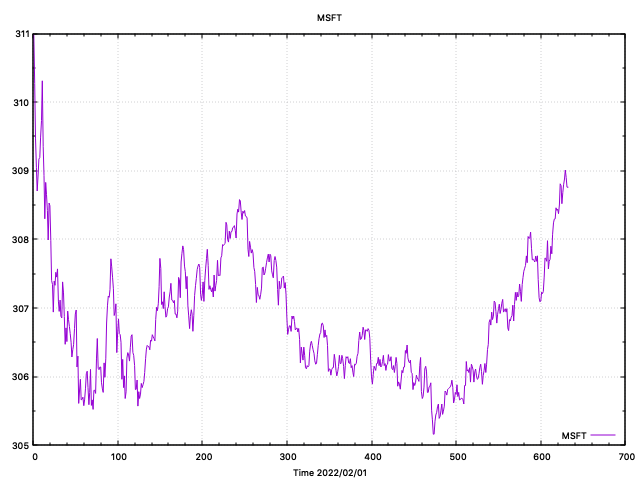
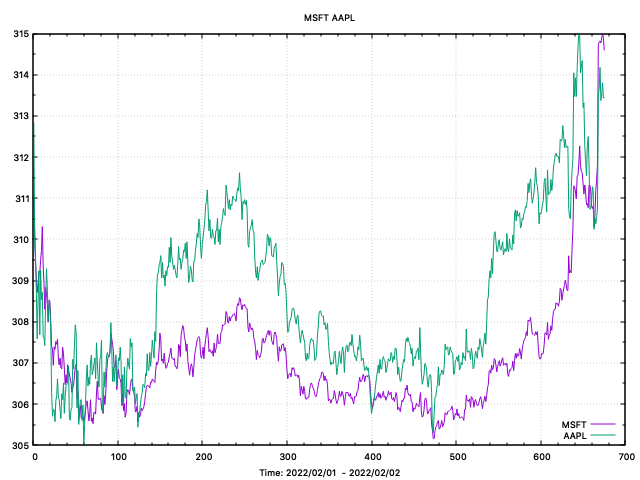

# Python Yahoo Finance

This program is used to record intra-minute stock data using Yahoo Finance's API. I
know there are packages such as yfinance and yahoo-finance, however, I found
these implementations to be particularly buggy when attempting to record intra-minute 
stock data in live time. Thus, I created my own implementation.

## Contents

1. [Overview](#overview)
2. [Requirements](#requirements)
3. [Compilation and Usage](#compilation-and-usage)
4. [Known Issues](#known-issues)

## Overview

This program does the following:

1. Configures a list of stocks, or indexes (^DJI for example) to record intra-minute
data for in real time.
2. Writes this data to a file inside the data directory in real-time. This data can
later be used for back-testing trading strategies.
3. Allows the user to plot this data across multiple days using Gnuplot.

## Requirements

- python3.8 (last I checked)
- gnuplot (if you would like to produce graphics)

## Compilation and Usage


If you live in the United States, to run the code, make sure you are running python3, and simply run the following 
command inside a terminal in the project directory:

```shell
python main.py
```

If, like me, you live somewhere other than the United States, you must the file through the startup.sh script. This will
change the time zone inside the running thread to East US. Simply run the following command inside a terminal in the 
project directory

```shell
docker/startup.sh
```

The startup.sh script has build in logic to run only during market opening hours. Meaning, it will sleep until the markets
open if they are not already open at the time you run the program.

To produce graphics, you may use the plot.py file. This provides an interface between Python and gnuplot. The program 
takes command line arguments:

```shell
usage: plot.py [-h] -t TICKER [-s START] [-e END]

Program to store intra-day data on Stocks

optional arguments:
  -h, --help            show this help message and exit
  -t TICKER, --ticker TICKER
                        The stock ticker(s). The capability tograph two stocks side by side is possible butyou must put 
                                             tickers in a string separated bya single space.
  -s START, --start START
                        The start date of data. Format: YYYY_MM_DD
  -e END, --end END     The end date of data. Format: YYYY_MM_DD

```

Note: The start date and end date assume that a directory of the same format (YYYY_MM_DD) exits inside of the data directory
with corresponding stock data for the given ticker.

## Results

The results are consistent and produce no bad data as far as I am aware. Below is an example of
the stock price for ticker MSFT on the February 1st, 2022:

To produce a plot of MSFT on a given day, use the following command:

```shell
python3 plot.py -t MSFT -s 2022_02_01 -e 2022_02_01
```



To produce a plot of MSFT and APPL over two days, use the following command:

```shell
python3 plot.py -t "MSFT APPL" -s 2022_02_01 -e 2022_02_02
```




## Known Issues

None at present.
